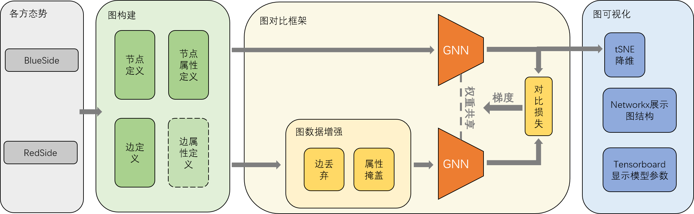

# Graph_Representation 
墨子态势图对比学习及可视化模块代码包


## 图表示模块使用说明
1. 目录设置：将graph_representation文件夹置于和main_versus.py同级。

2. 在main_versus.py中加入`from graph_representation.graph_main import Graph`导入接口类。

3. 在main_versus.py中的side实例化代码之后加入 `graph = Graph(side, env.scenario.get_side_by_name('红方'))`来实例化图表示接口类。

4. 在main_versus.py推演的循环中（如在env.step()前一行）加入`graph.graph_representation_blue()`来在每一轮实时更新图结构，并以当前图为训练数据自监督地训练GNN，最后进行可视化。

5. 在命令行使用`python main_versus.py`（提前进入到main_versus.py所在的父目录）来运行墨子。

6. 在命令行使用`tensorboard --logdir=graph_representation/runs`(以Windows系统格式的目录为例)来观察TensorBoard实时反馈的模型权重训练结果。

## 各文件说明
- graph_parse.py：传递图表示模块的参数

- graph_main.py：图表示模块的接口类

- graph_construct.py：建立图（定义节点、节点属性、边等）

- graph_learning_GNN.py：图神经网络（编码器）

- graph_learning_GCL.py：对比学习框架（自监督训练方法）

- graph_learning.py：调用图对比框架训练图神经网络

- graph_visualization.py：可视化（图、模型参数）

- imgs/nx：存放networkx对态势图的可视化结果

- imgs/tsne：存放tSNE对节点向量的可视化结果

- runs：存放tensorboardX对模型权重参数的可视化结果

- encoder_GNN_weights.pth.tar：存放模型参数

## 建图说明
```python
#目前版本选择的节点类型
self.admissible_node_type = ['aircrafts', 'facilities', 'ships', 'submarines', 'weapons', 'satellites']

#通用的节点属性1——属性值为1维
self.attr_vector_list_all_1 = ['side','ClassName', 'strName', 'm_ProficiencyLevel', 'dLatitude', 'dLongitude', 'fAltitude_AGL',
                                'iAltitude_ASL', 'fCurrentHeading', 'fCurrentSpeed', 'm_CurrentThrottle', 'bAutoDetectable', 
                                'strActiveUnitStatus', 'dFuelPercentage', 'strDamageState']
#通用的节点属性2——属性值为多维，需要解析为1维的值
self.attr_vector_list_all_2 = ['get_mounts()', 'get_ai_targets()', 'get_loadout()', 'get_sensor()', 'get_weapon_infos()']
#飞机节点专有的属性(yaw==heading, 故不重复表示)
self.attr_vector_list_aircrafts = ['strFuelState', 'fPitch', 'fRoll', 'iCurrentFuelQuantity']
#设施节点专有的属性
self.attr_vector_list_facilities = []
#舰船节点专有的属性
self.attr_vector_list_ships = []
#潜艇节点专有的属性
self.attr_vector_list_submarines = []
#武器节点专有的属性
self.attr_vector_list_weapons = []
#卫星节点专有的属性
self.attr_vector_list_satellites = []

#允许的边的类型（有向边）
self.admissible_edge_type = ['m_CurrentHostUnit(facility-->aircraft)', 'm_FiringUnitGuid(unit-->weapon)', 'm_PrimaryTargetGuid(weapon-->target)']
```

### 将属性转换为浮点数的规定
- side属性值己方为1. 敌方为2.

- bool转为0./1.

- ClassName和strName枚举为1./2./3. ...

- 其余不可枚举的字符型属性使用word embedding包转为浮点（值/向量）**TODO**

- ……

## 图神经网络说明
- 借助torch_geometric包（PyG）实现GCN，其架构为：
> Conv(input_dim, 32) &rarr; relu &rarr; Conv(32,32) &rarr; relu &rarr; Conv(32,output_dim)

## 图对比学习框架说明
- 提供的数据增强方法：
    - edge_drop：以一定的比例随机删去一些边
    
    - attr_mask：以一定的比例选择属性的某些维度，并将其置零

- InfoNCE loss：采用BC loss源代码的实现方法（https://github.com/anzhang314/BC-Loss.git）

## 训练模式说明
- 在墨子的推演前初始化GNN编码器（可加载预训练的参数）

- 在推演的每一轮，首先建立当前的态势图（并转换为PyG的数据格式），然后利用对比学习框架进行数据增强，接着使用InfoNCE损失对上述GNN编码器进行自监督的训练

- 注意推演的每一轮都为同一个GNN编码器提供了一个训练样本图，GNN编码器在推演的每一轮都会在新的态势图上训练一定的epoch（如100 epochs）

- 每训练一定轮次，会用训练后的GNN编码器来对当前的态势图进行图嵌入，使用可视化模块对嵌入结果和图结构进行可视化

## 可视化说明
- t_SNE：对节点属性和节点embedding两种高维向量进行低维可视化

- nxnetworkx：基于t_SNE的降维结果将图上的节点表示在二维平面，并连上边；以我方为蓝方为例，红色为观测到的敌方，黄色为未观测到的敌方

- tensorboardX：基于tensorboard将模型的权重参数实时可视化
